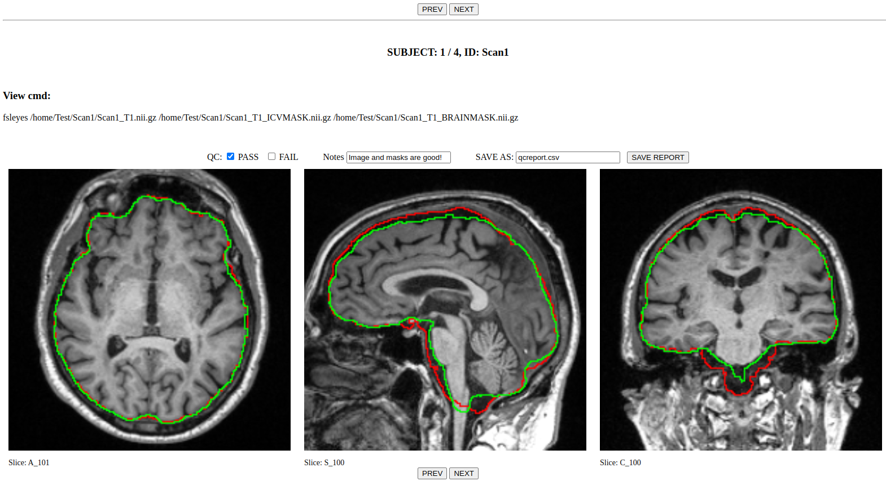

MRISnapshot: Fast Visual QC of MRI Datasets
===========================================

Full documentation:  **https://cbica.github.io/MRISnapshot/**

About
-----
``MRISnapshot`` is a tool designed to facilitate the quality control (QC) process of raw and processed MRI datasets. 

``MRISnapshot`` is used to create a QC report in *.html* format with a few simple commands. The QC report displays snapshots of underlay and overlay images for multiple subjects, with easy navigation between scans, and with an editable QC form for annotations, which can be saved in a *.csv* report file. 

``MRISnapshot`` provides a set of configuration parameters to allow users to customize the contents of the report for different needs and use cases.

   
   Example QC Report that shows ICV and Brainmask overlays on T1 scans in axial, sagittal and coronal views

